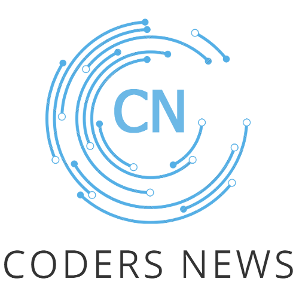

 
<h1 align="center"> Coders News</h1>

<h2 align="center"> Introduccion</h2>

El proyecto llamado Coder News apunta al desarrollo de una pagina Web de Coders, o sea, programadoras capacitandose para que el proyecto pueda ser útil y funcionable en su actualidad

<h2 align="center">Funcionalidades Y Página</h2>

La pagina tiene un par de tarjetas con movilidad y adaptacion al mismo tiempo en el que se van actualizando las noticias. Tambien cuenta con un carrusel en el que los usuarios pueden hacer scroll.

 Hasta el momento podemos hablar de las Api que fuimos metiendo de a poco para que la pagina tenga mas movilidad e interaccion con el usuario.

Tambien podemos hablar de la introduccion de la dolaricacion y los euros en la propia pagina.

 <h2 align="center"> Intengrantes del proyecto (Coders) </h2>
  

 Antonella Procacci

  

 Agustina Barbona

  

 Milagros Torres

  

 Giuliana Villaroel

  
 

   
   
 

